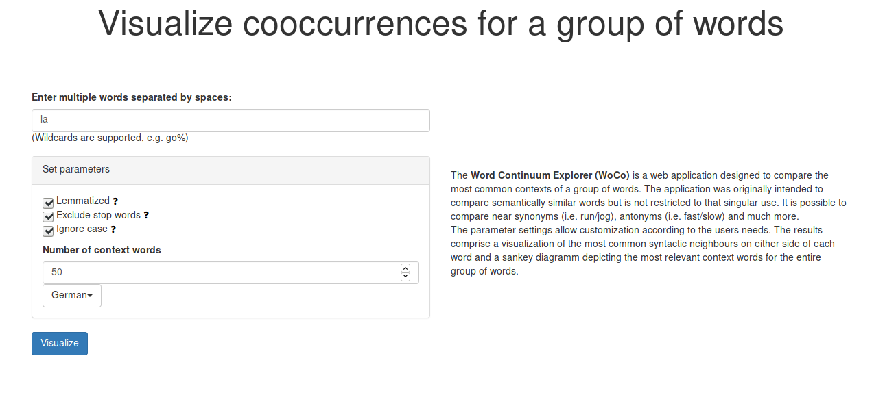
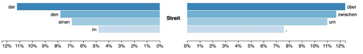

# Word Continuum Explorer (WoCo)
The Word Continuum Explorer (WoCo) is a web application designed to compare the most common contexts of a group of words. The application was originally intended to compare semantically similar words but is not restricted to that singular use. It is possible to
compare near synonyms (i.e., run/jog), antonyms (i.e., fast/slow) and much more. The parameter settings allow customization according to the users needs. The results comprise a visualization of the most common syntactic neighbours on either side of each
word and a sankey diagramm depicting the most relevant context words for the entire group of words.

## Preview WoCo

The web application is no longer running.

